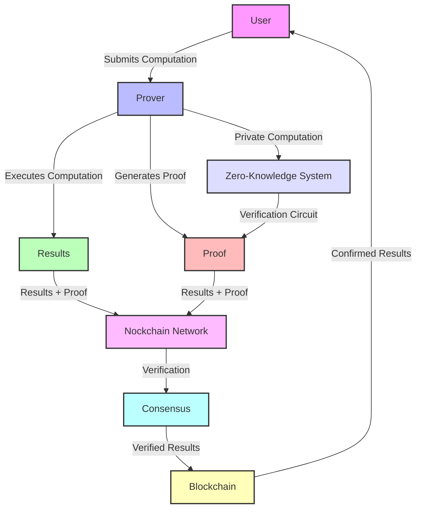
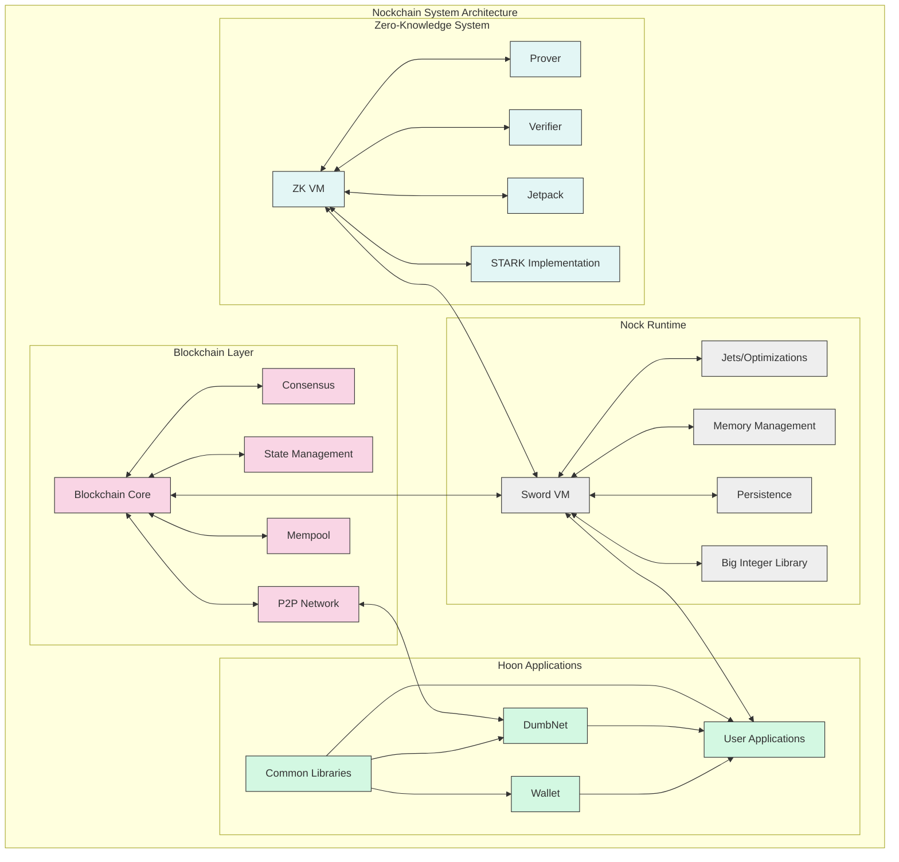
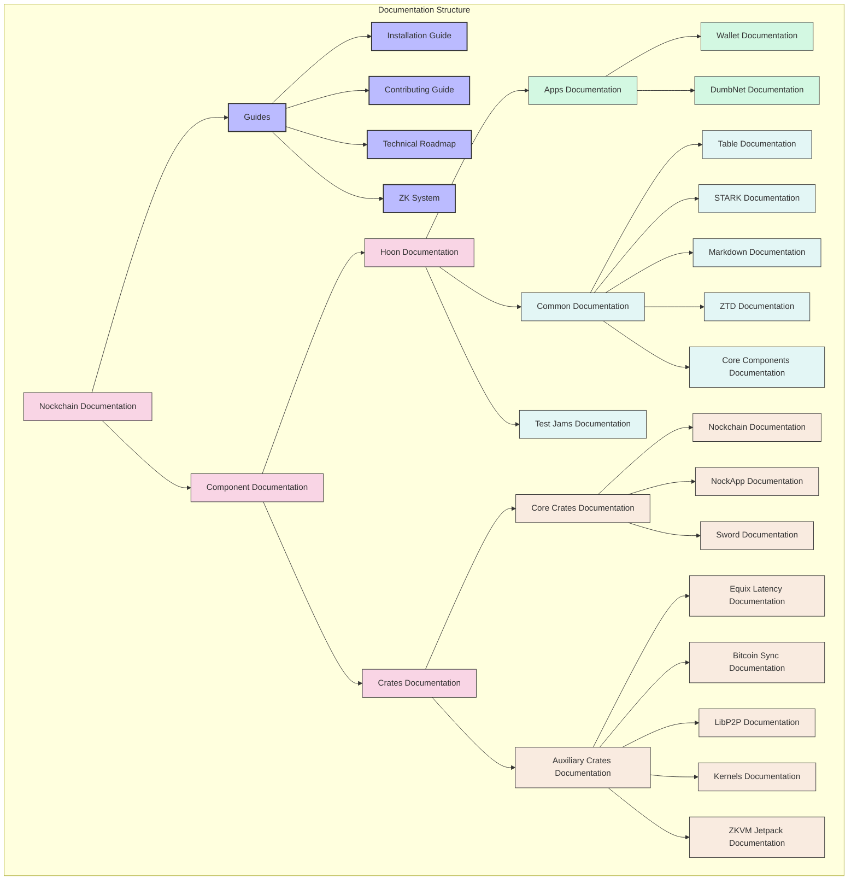
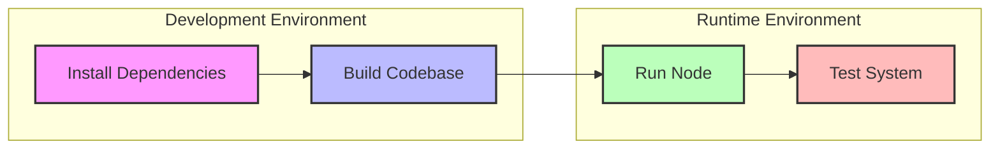

# Nockchain Documentation

This directory contains technical documentation for the [Nockchain](https://github.com/tetra/nockchain) project, a lightweight blockchain for heavyweight verifiable applications.

## Project Overview

Nockchain is designed to enable trustless settlement of heavyweight verifiable computation by replacing verifiability-via-public-replication with verifiability-via-private-proving. This approach means:

- Proving happens off-chain
- Verification occurs on-chain
- Computation is scalable and private

## Architecture

The Nockchain platform consists of several key components:

1. **Blockchain Layer**: A lightweight blockchain for consensus and verification
2. **Nock Runtime**: The Sword VM providing the execution environment
3. **Hoon Applications**: User-facing applications and services
4. **Zero-Knowledge System**: Enabling private computation with public verification

## Contents

### Primary Documentation

- [**Installation Guide**](./INSTALLATION.md): Detailed setup instructions for all platforms
- [**Technical Roadmap**](./ROADMAP.md): Current status and future development plans
- [**Contributing Guide**](./CONTRIBUTING.md): How to contribute to the Nockchain project
- [**Zero-Knowledge System**](./ZK_SYSTEM.md): Comprehensive overview of the ZK proof system

### Component Documentation

- [**Hoon**](./hoon/): Documentation for [Hoon](../hoon/) components
  - [Apps](./hoon/apps.md): Documentation for Hoon applications
  - [Common](./hoon/common.md): Documentation for common Hoon libraries
  - [Test Jams](./hoon/test-jams.md): Documentation for test jam files

- [**Crates**](./crates/): Documentation for [Rust crates](../crates/)
  - [Nockchain](./crates/nockchain.md): Core blockchain implementation
  - [Sword](./crates/sword.md): Nock interpreter and runtime
  - [NockApp](./crates/nockapp.md): Application framework
  - [ZKVM Jetpack](./crates/zkvm-jetpack.md): ZK VM acceleration
  - [Network Crates](./crates/nockchain-libp2p-io.md): P2P networking layer
  - [Auxiliary Crates](./crates/README.md#auxiliary-crates): Supporting components

## Documentation Map

## Getting Started

To get started with Nockchain, refer to these documents:

1. [Installation Guide](./INSTALLATION.md) for setting up your environment
2. [Main README](../README.md) for a project overview
3. [Technical Roadmap](./ROADMAP.md) for understanding the project's direction

For developers interested in contributing:

1. [Contributing Guide](./CONTRIBUTING.md) for development workflow
2. [Component documentation](#component-documentation) for technical details
3. [Zero-Knowledge System](./ZK_SYSTEM.md) for ZK proof system details

## Further Reading

- [DEVELOPERS.md](../crates/sword/DEVELOPERS.md): Development guidelines for Sword
- [Makefile](../Makefile): Build commands and project structure 