# Nockchain Documentation

This directory contains technical documentation for the [Nockchain](https://github.com/tetra/nockchain) project, a lightweight blockchain for heavyweight verifiable applications.

## Project Overview

Nockchain is designed to enable trustless settlement of heavyweight verifiable computation by replacing verifiability-via-public-replication with verifiability-via-private-proving. This approach means:

- Proving happens off-chain
- Verification occurs on-chain
- Computation is scalable and private

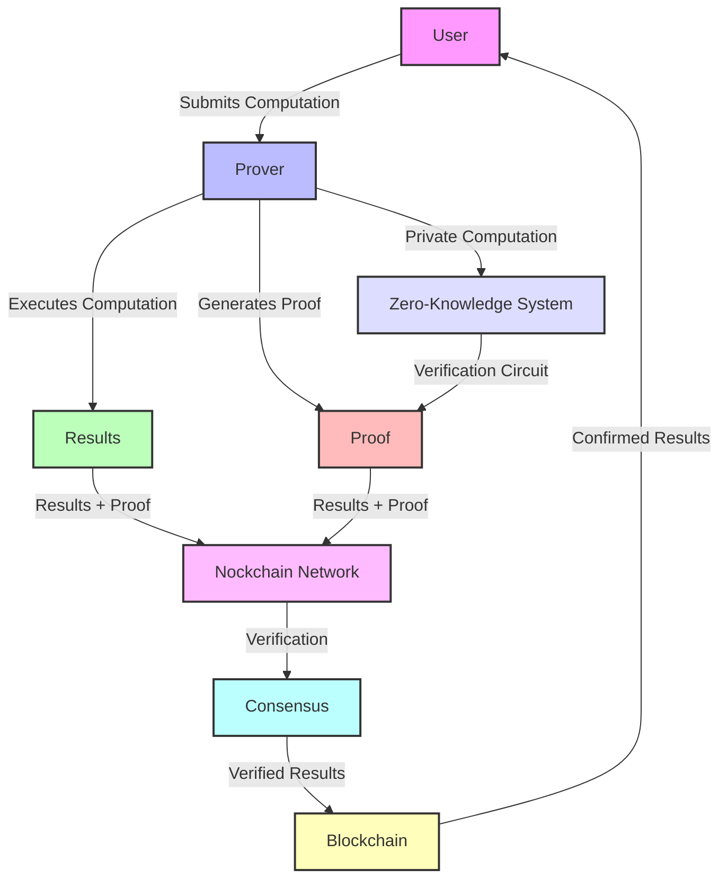

## Architecture

The Nockchain platform consists of several key components:

1. **Blockchain Layer**: A lightweight blockchain for consensus and verification
2. **Nock Runtime**: The Sword VM providing the execution environment
3. **Hoon Applications**: User-facing applications and services
4. **Zero-Knowledge System**: Enabling private computation with public verification

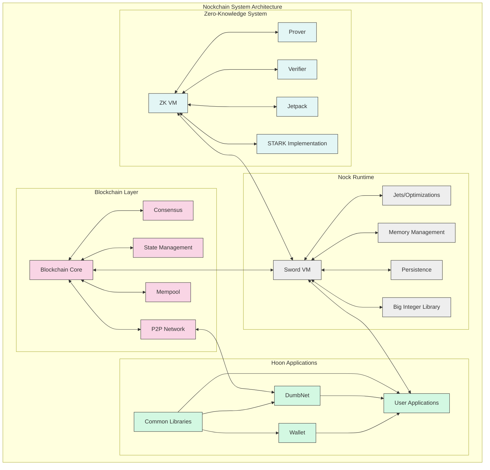

### Component Interaction Model

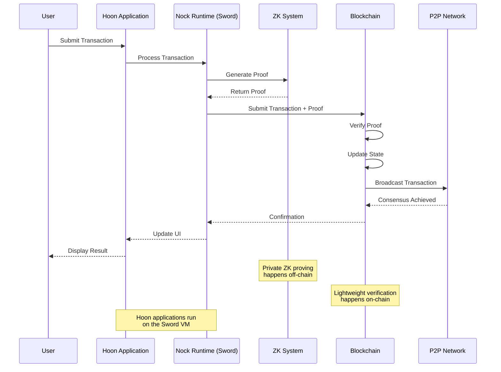

## Zero-Knowledge System Architecture

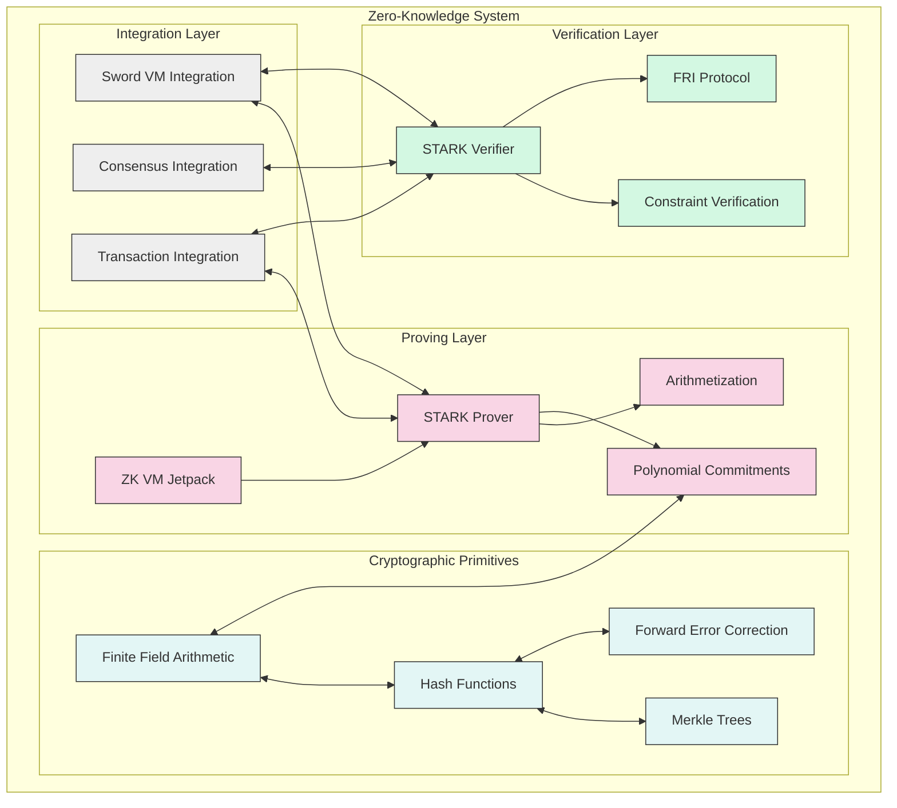

## Technology Stack

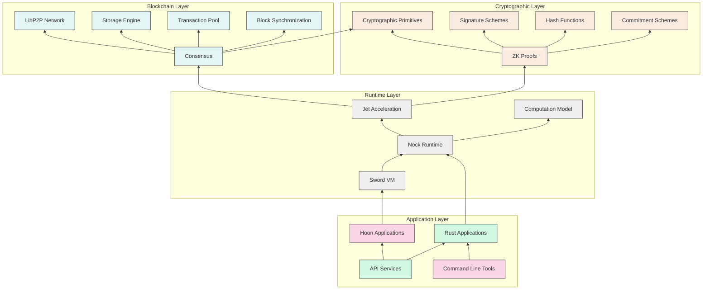

## Project Structure

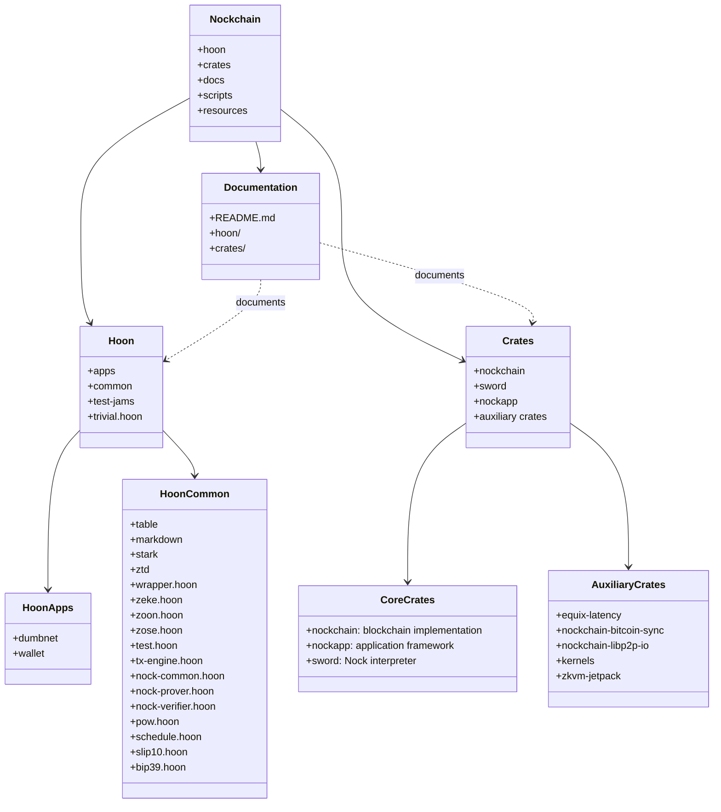

## Data Flow Architecture

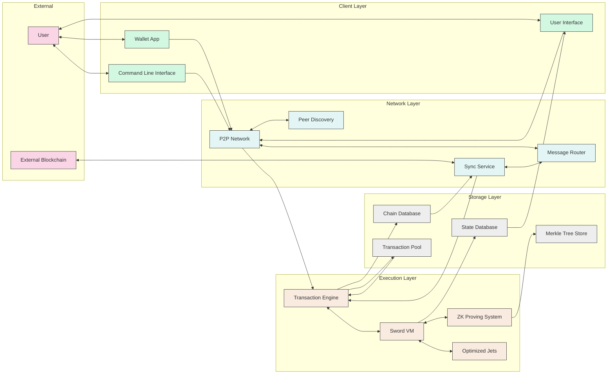

## Transaction Lifecycle

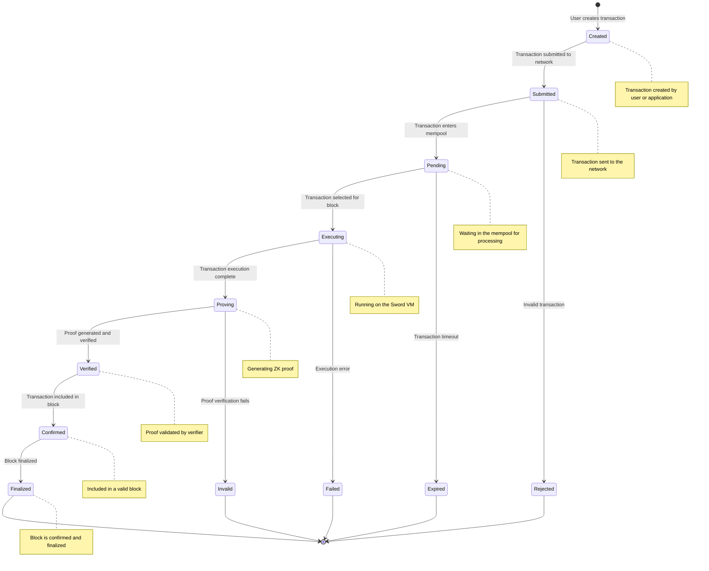

## Consensus Algorithm

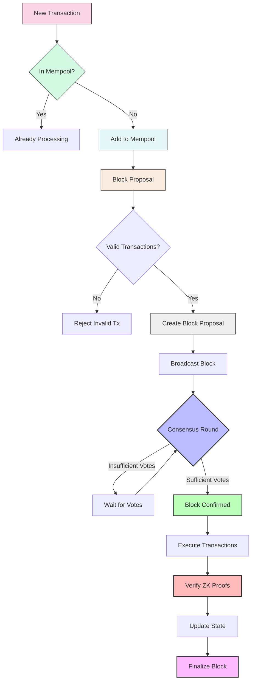

## Contents

- [Hoon](./hoon/): Documentation for [Hoon](../hoon/) components
  - [Apps](./hoon/apps.md): Documentation for Hoon applications
  - [Common](./hoon/common.md): Documentation for common Hoon libraries
  - [Test Jams](./hoon/test-jams.md): Documentation for test jam files
- [Crates](./crates/): Documentation for [Rust crates](../crates/)

## Component Relationships

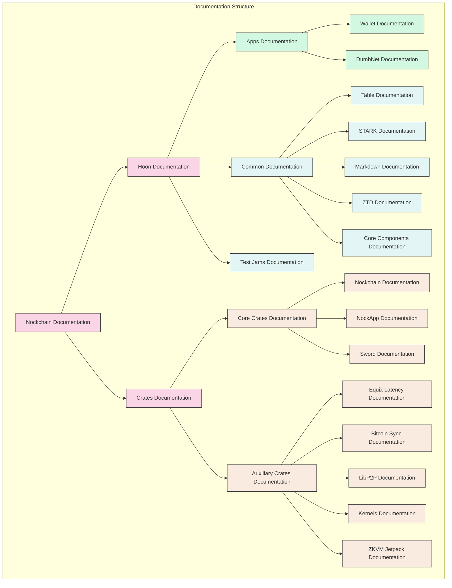

## Getting Started

To get started with Nockchain, refer to the main [README](../README.md) for setup instructions, including:

- Installing dependencies
- Building the codebase
- Running a node
- Testing the system

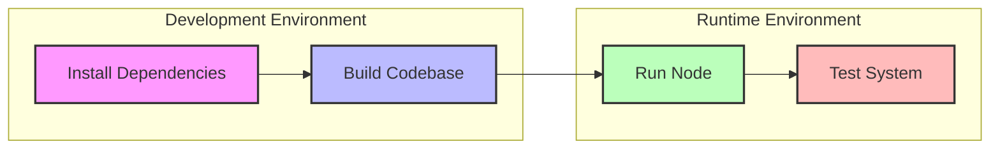

## Development Workflow

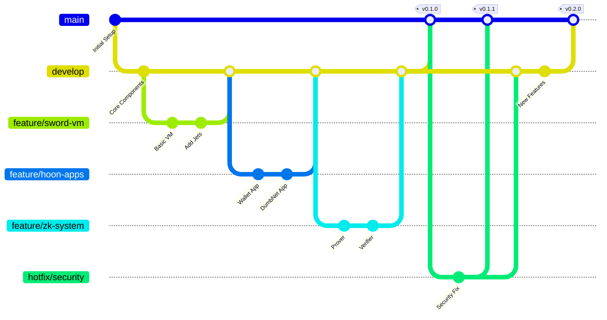

## Performance Metrics

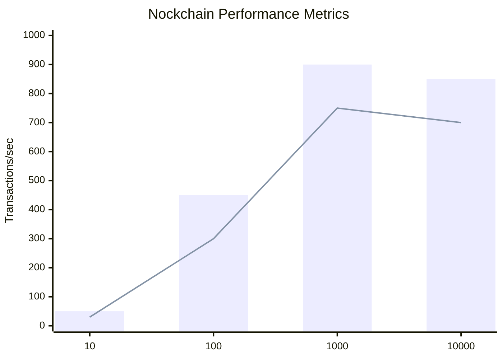

## Further Reading

- [DEVELOPERS.md](../crates/sword/DEVELOPERS.md): Development guidelines for Sword
- [Makefile](../Makefile): Build commands and project structure 