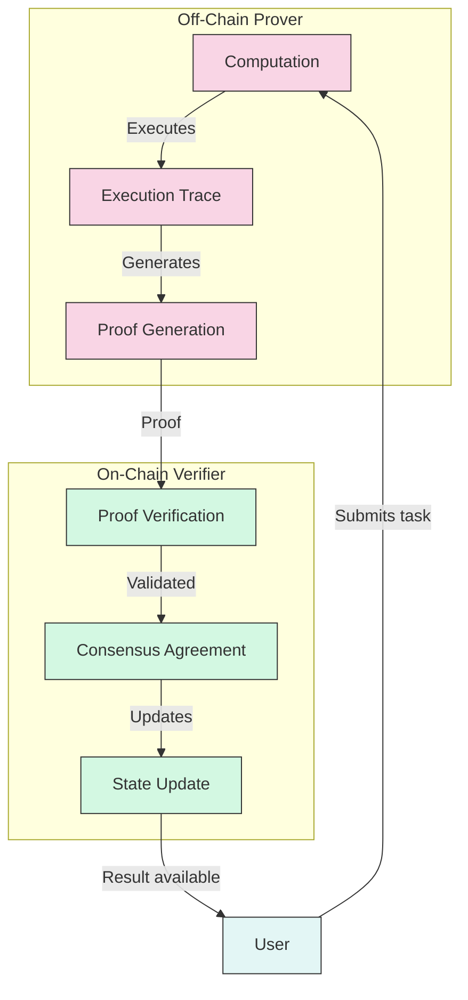
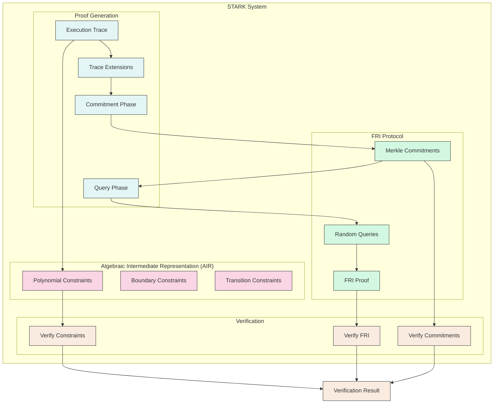
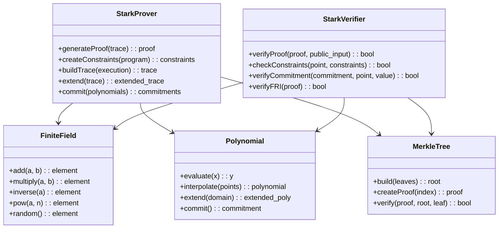
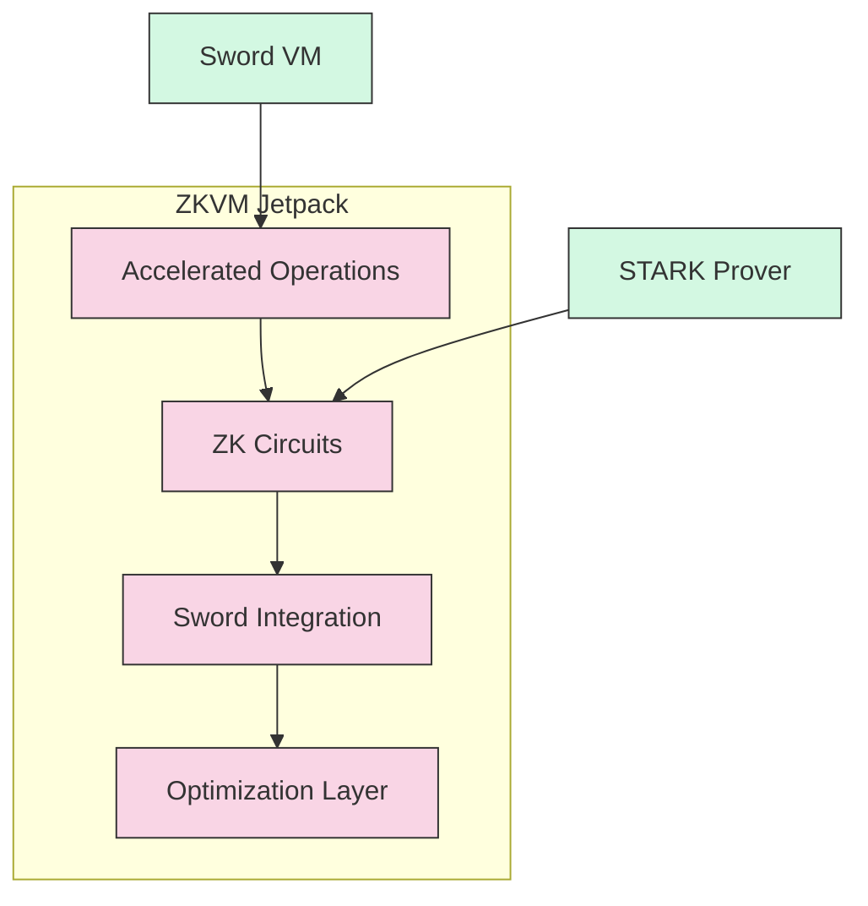
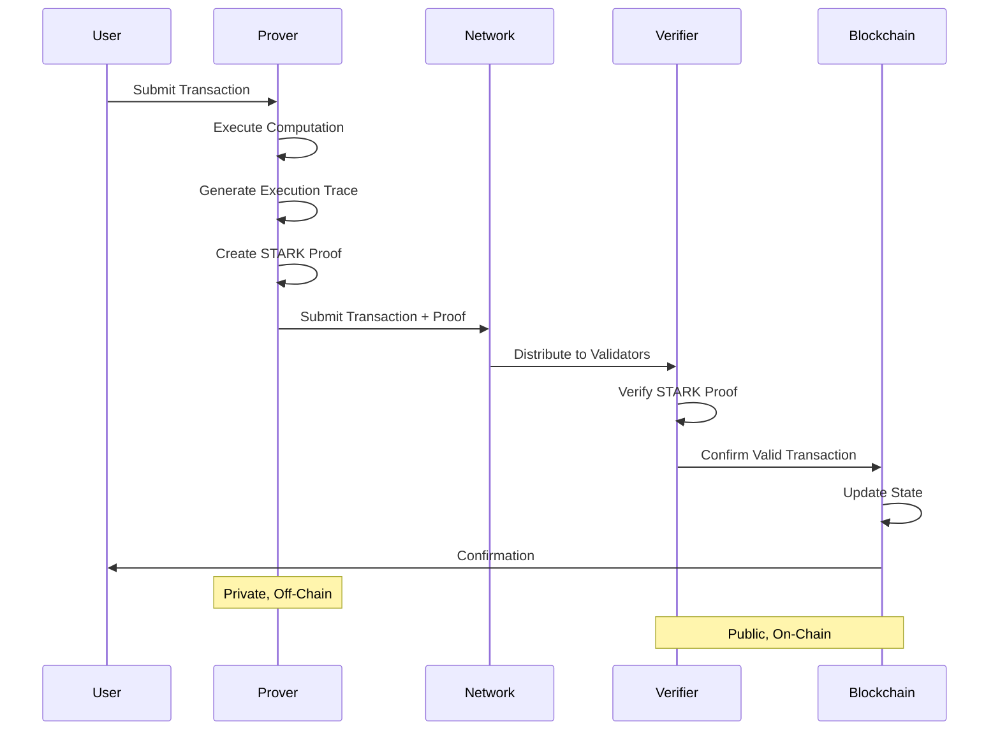
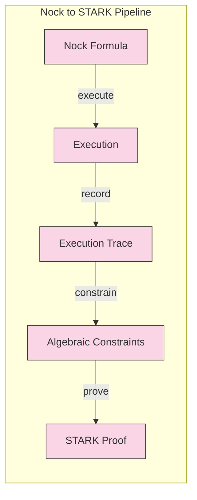
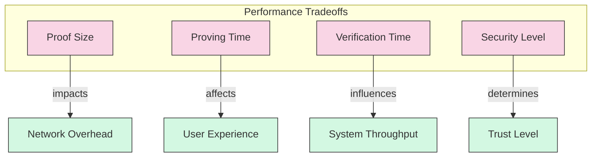
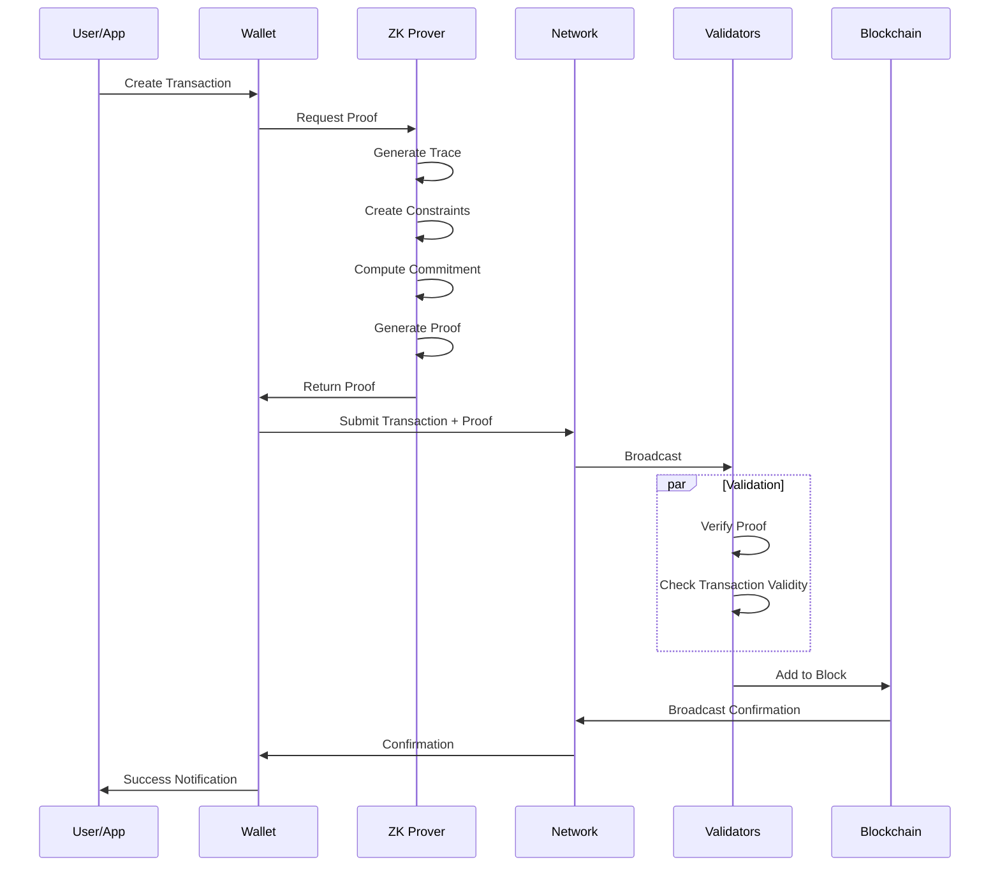
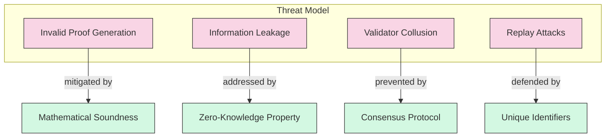

# Nockchain Zero-Knowledge System

This document provides a detailed overview of the Zero-Knowledge (ZK) proof system implemented in Nockchain, explaining its architecture, components, and how it enables private verifiable computation.

## Overview

The Nockchain ZK system allows computation to be performed privately off-chain while providing cryptographic proof of correctness that can be efficiently verified on-chain. This approach enables:

- **Privacy**: The details of computation remain confidential
- **Scalability**: Complex computation happens off-chain
- **Verifiability**: Results can be cryptographically verified
- **Efficiency**: Verification is lightweight compared to re-execution



## STARK Implementation

Nockchain uses STARKs (Scalable Transparent ARguments of Knowledge) as its primary ZK proof system. STARKs offer several advantages:

- No trusted setup required
- Post-quantum security
- Scalable proof generation
- Relatively simple cryptographic assumptions

### STARK Architecture



## Components

### Hoon STARK Implementation

Located in [`hoon/common/stark/`](../hoon/common/stark/), the Hoon STARK implementation provides:

- Proof generation for Nock computation
- Field arithmetic operations
- Polynomial commitment schemes
- FRI protocol implementation
- Constraint system construction



### ZKVM Jetpack

Located in [`crates/zkvm-jetpack/`](../crates/zkvm-jetpack/), the ZKVM Jetpack provides:

- Accelerated VM operations for zero-knowledge proofs
- Specialized circuits for common operations
- Integration with the Sword runtime
- Optimized proof generation



## Integration with Nockchain

### Transaction Lifecycle with ZK Proofs



### Nock Verification

Nockchain provides special components for proving and verifying Nock computation:

- [`nock-prover.hoon`](../hoon/common/nock-prover.hoon): Generates proofs for Nock execution
- [`nock-verifier.hoon`](../hoon/common/nock-verifier.hoon): Verifies proofs of Nock execution

```mermaid
graph TD
    subgraph "Nock ZK System"
        NOCK_CODE[Nock Code]
        SWORD[Sword VM]
        TRACE[Execution Trace]
        CONSTRAINTS[Constraint System]
        PROVER[Nock Prover]
        PROOF[ZK Proof]
        VERIFIER[Nock Verifier]
        RESULT[Verification Result]
    end
    
    NOCK_CODE -->|executed by| SWORD
    SWORD -->|produces| TRACE
    TRACE -->|converted to| CONSTRAINTS
    CONSTRAINTS -->|used by| PROVER
    PROVER -->|generates| PROOF
    PROOF -->|verified by| VERIFIER
    VERIFIER -->|produces| RESULT
    
    classDef input fill:#f9d5e5,stroke:#333,stroke-width:1px
    classDef process fill:#d3f8e2,stroke:#333,stroke-width:1px
    classDef output fill:#e3f6f5,stroke:#333,stroke-width:1px
    
    class NOCK_CODE,PROOF input
    class SWORD,TRACE,CONSTRAINTS,PROVER,VERIFIER process
    class RESULT output
```



## Nock to STARK Conversion

The process of converting Nock computation to STARK-provable form involves:

1. **Trace Generation**: Recording all steps of Nock execution
2. **Constraint Formulation**: Expressing the computation as polynomial constraints
3. **Proof Construction**: Generating a STARK proof of correct execution
4. **Verification**: Validating the proof against public inputs and outputs



## Performance Considerations

The ZK system in Nockchain balances several performance factors:



### Optimizations

Nockchain implements several optimizations for its ZK system:

1. **Specialized Circuits**: Custom-designed circuits for common operations
2. **Batched Proofs**: Combining multiple proofs to amortize verification costs
3. **Recursive Proving**: Using proof composition for incremental verification
4. **Hardware Acceleration**: Support for GPU acceleration of proof generation
5. **Caching**: Reusing intermediate computations when applicable

## Example: ZK Transaction Flow



## Security Considerations

The security of the ZK system depends on:

1. **Soundness**: Impossible to generate valid proofs for invalid computations
2. **Completeness**: Valid computations always have valid proofs
3. **Zero-Knowledge**: Proofs reveal nothing about the private inputs
4. **Collisions**: Cryptographic hash function security

### Threat Model



## Development Guide

### Creating ZK-Verifiable Nock Computations

To create ZK-verifiable Nock computations:

1. Define your computation in Hoon
2. Compile to optimized Nock code
3. Execute with the prover to generate a trace
4. Create STARK proof
5. Submit for verification

```hoon
|=  [public-input=* private-input=*]
=/  computation=_|=(* *)  
  |=(* (add private-input public-input))
=/  result=*  (computation private-input)
=/  proof=*  (generate-proof computation private-input)
[result proof]
```

### Verifying ZK Proofs

To verify ZK proofs:

```hoon
|=  [public-input=* result=* proof=*]
?.  (verify-proof proof public-input result)
  %.n
%.y
```

## Future Developments

Planned enhancements to the ZK system include:

1. **Recursive STARKs**: For more efficient composable proofs
2. **Specialized Circuits**: For common blockchain operations
3. **Multi-Prover Protocol**: Distributed proof generation
4. **Privacy Enhancements**: Additional protections for metadata
5. **Hardware Acceleration**: Dedicated ASIC/FPGA support

## Related Documentation

- [Sword VM](./crates/sword.md): Runtime environment for Nock code
- [ZKVM Jetpack](./crates/zkvm-jetpack.md): Accelerated VM operations
- [Hoon Common](./hoon/common.md): Common Hoon libraries including STARK
- [Technical Roadmap](./ROADMAP.md): Future development plans 