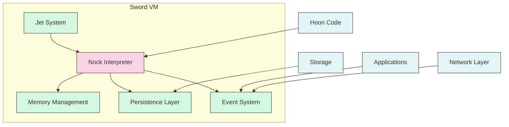
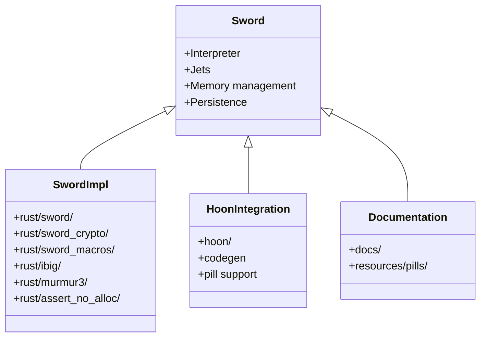
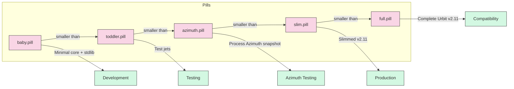
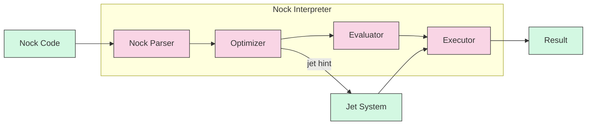
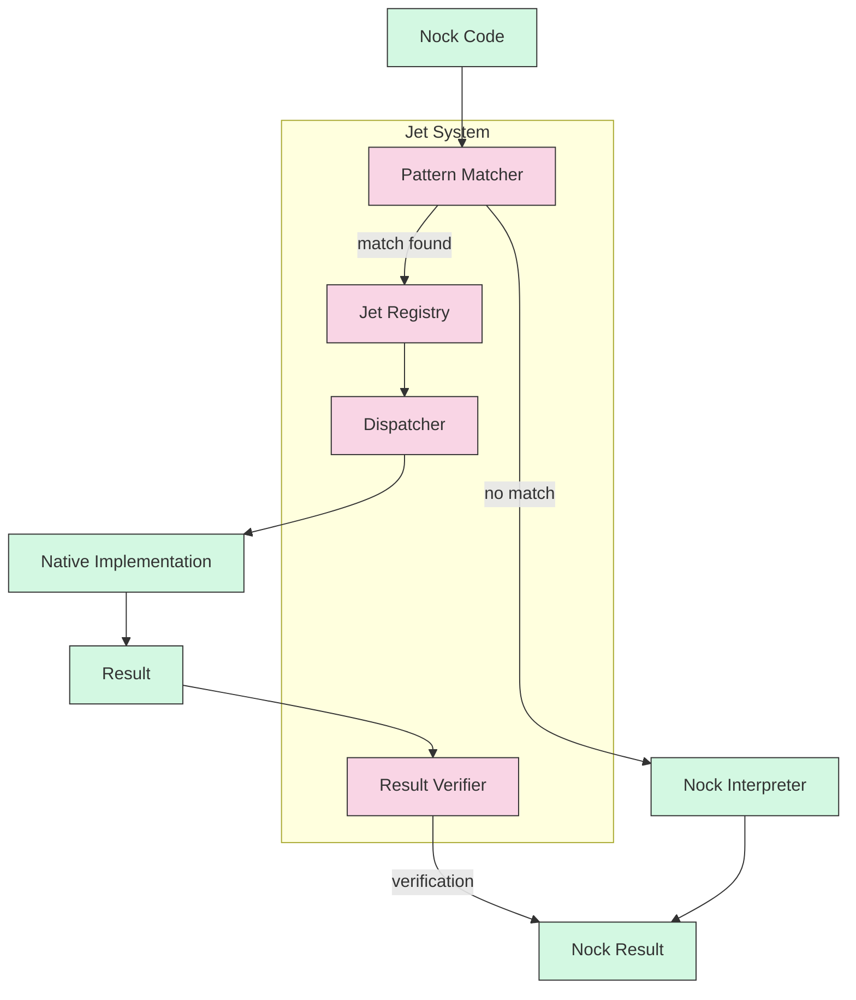
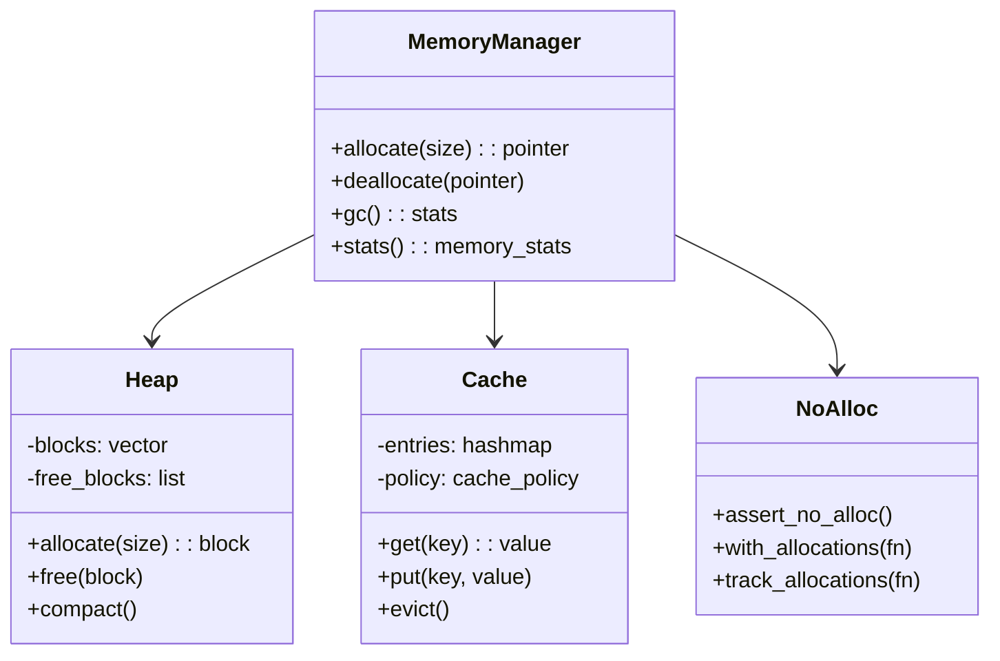
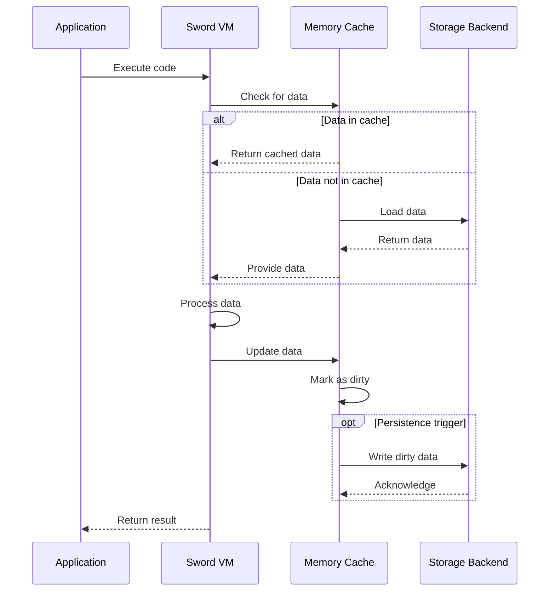
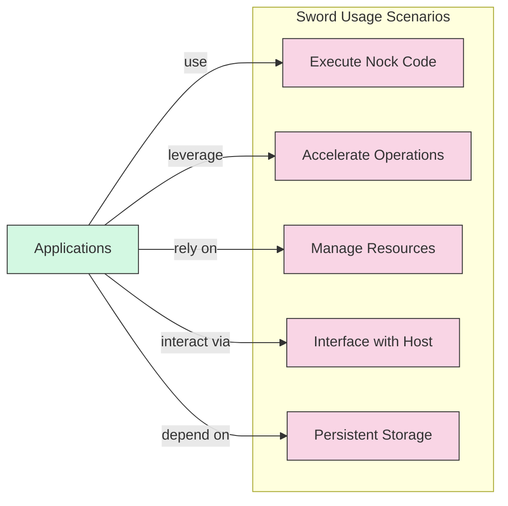
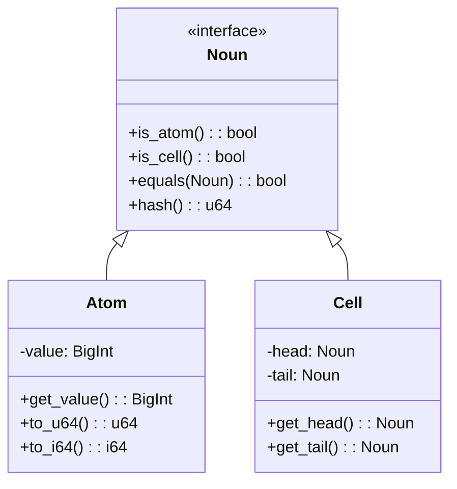
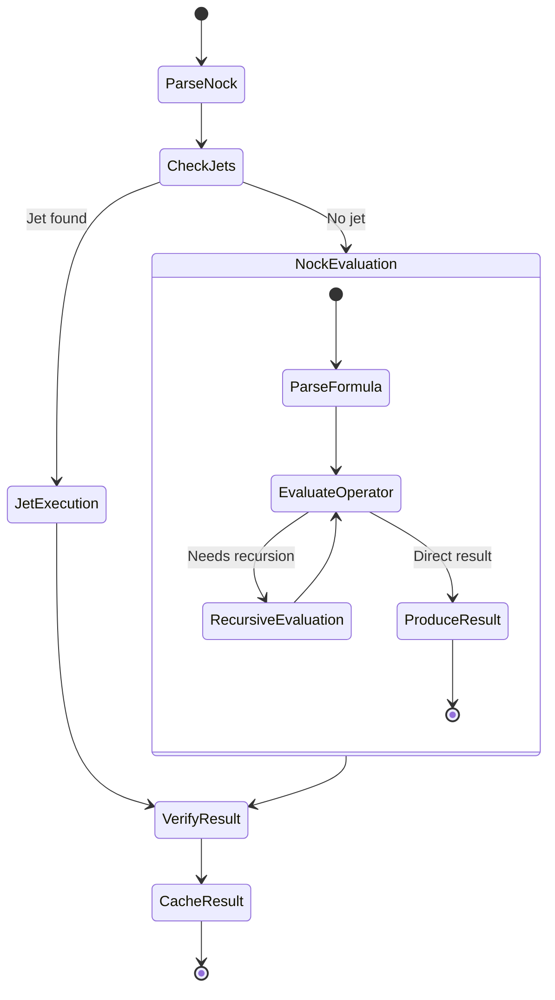

# Sword

## Overview

The [`sword`](../../crates/sword/) crate is the Nock interpreter and runtime environment for the [Nockchain](../../) project. It provides the core execution environment for Nock code with automatic persistence and optimization capabilities.

## Directory Structure

Located in [`crates/sword/`](../../crates/sword/).

### Key Subdirectories

- [`rust/sword/`](../../crates/sword/rust/sword/): Core implementation
  - [`src/jets/`](../../crates/sword/rust/sword/src/jets/): Jet (native function) implementations for optimized execution
  - [`src/substantive/`](../../crates/sword/rust/sword/src/substantive/): Core data structures and algorithms
- [`rust/sword_crypto/`](../../crates/sword/rust/sword_crypto/): Cryptographic primitives for secure operations
- [`rust/sword_macros/`](../../crates/sword/rust/sword_macros/): Procedural macros for code generation
- [`rust/ibig/`](../../crates/sword/rust/ibig/): Big integer implementation for arbitrary-precision arithmetic
- [`rust/murmur3/`](../../crates/sword/rust/murmur3/): Murmur3 hash implementation for fast hashing
- [`rust/assert_no_alloc/`](../../crates/sword/rust/assert_no_alloc/): Allocation control utilities for memory management
- [`hoon/`](../../crates/sword/hoon/): Hoon integration components including codegen
- [`docs/`](../../crates/sword/docs/): Design documents and specifications
- [`resources/pills/`](../../crates/sword/resources/pills/): Pill files for testing and development

## Pills

Sword uses various pill files for development and testing, located in `resources/pills/`:

- **baby.pill**: A minimal Arvo-shaped core and Hoon standard library
- **toddler.pill**: A slightly more complex Arvo and Hoon for testing jets
- **azimuth.pill**: A pill that processes an Azimuth snapshot
- **full.pill**: The complete Urbit v2.11 pill
- **slim.pill**: A slimmed down version of the Urbit v2.11 pill

## Components

### Nock Interpreter

- Core Nock interpreter with efficient evaluation
- Advanced optimizer for common patterns
- Support for all Nock operations
- Structured error handling
- Performance profiling and metrics

### Jet System

- Advanced jet (accelerated function) system for performance-critical operations
- Automatic registration and discovery of jets
- Result verification for correctness
- Hierarchical jet organization
- Fast pattern matching for jet detection

### Memory Management

- Efficient memory management for Nock data structures
- Automatic garbage collection
- Memory pooling for common object sizes
- Cache system for frequently accessed data
- Low-overhead allocation tracking

### Persistence Layer

- Automatic persistence of Nock computations
- Efficient serialization/deserialization
- Transaction support for atomic operations
- Incremental state snapshots
- Background persistence with minimal impact on performance

## Usage

The `sword` crate is used to:

- Execute Nock code with high performance
- Provide accelerated functions via jets for common operations
- Manage memory and resources efficiently
- Interface with the host environment for I/O
- Support persistent storage of Nock computations

## Implementation Details

### Noun Structure

### Evaluation Process

## Related Crates

- [nockapp](./nockapp.md): Application framework
- [zkvm-jetpack](./zkvm-jetpack.md): Zero-knowledge VM jet acceleration 