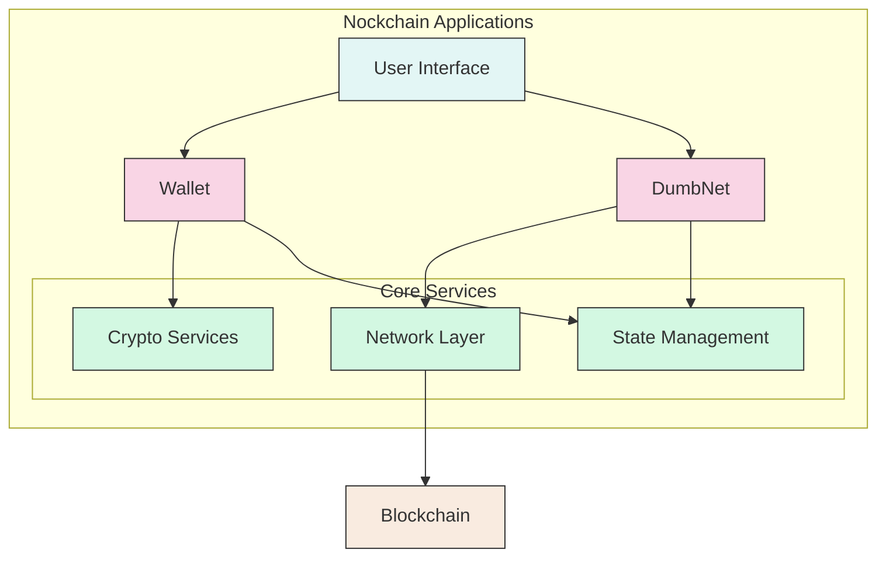
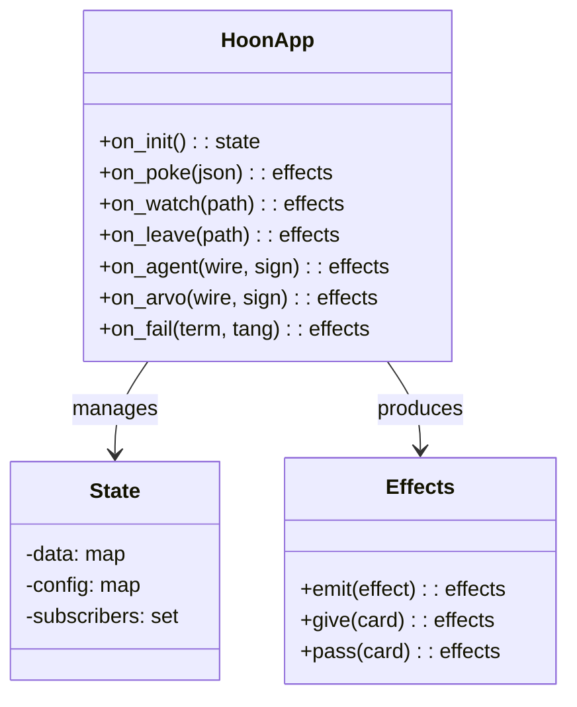
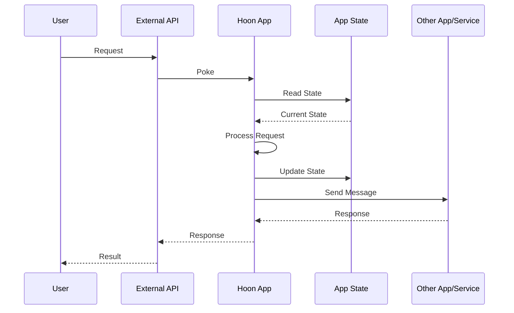
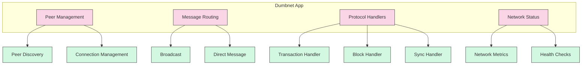
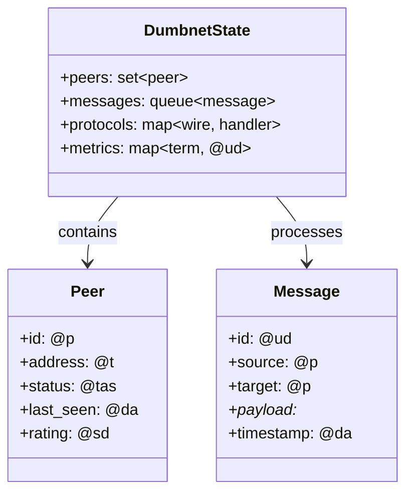
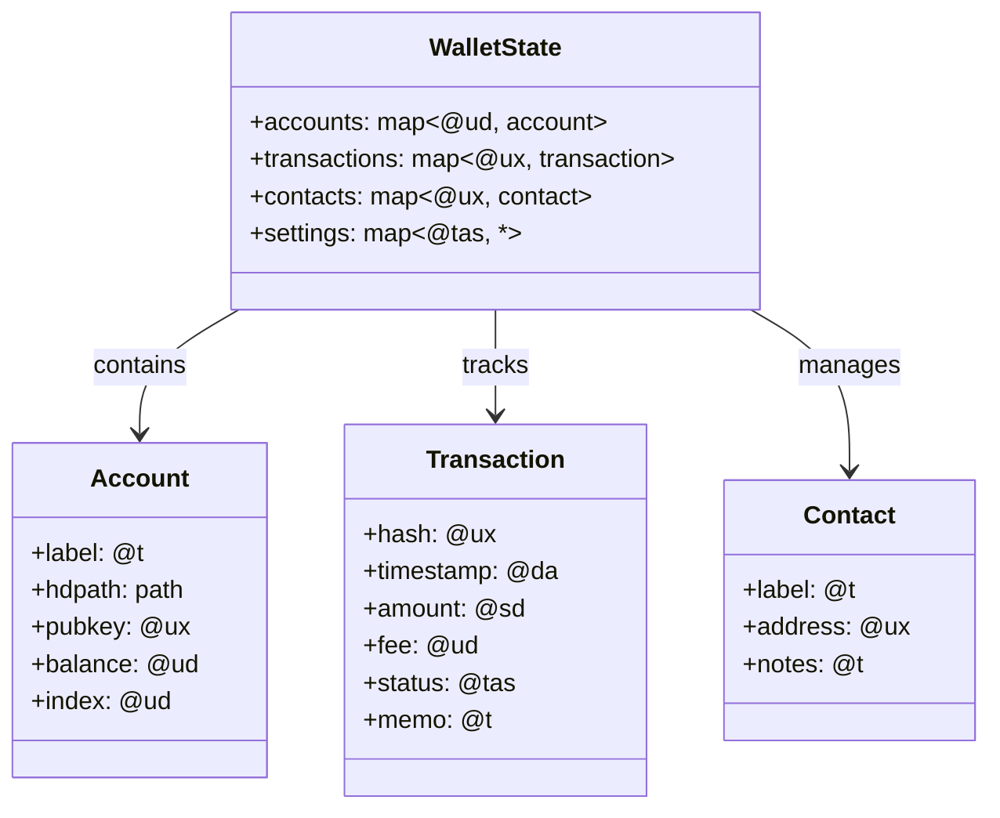

# Hoon Applications

## Overview

This document describes the [Hoon applications](../../hoon/apps/) in the [Nockchain](../../) project. These applications provide the user-facing functionality and core services of the Nockchain platform.

## Application Architecture

Hoon applications in Nockchain follow a consistent architecture:
- **State Management**: Each app maintains persistent state
- **Event Handling**: Apps process incoming events and produce responses
- **Inter-App Communication**: Apps can communicate with each other
- **API Exposure**: Apps provide interfaces for external interaction

## Applications

### Dumbnet

Located in [`hoon/apps/dumbnet/`](../../hoon/apps/dumbnet/).

A simple networking application for Nockchain that provides:
- Peer discovery and connection management
- Network message routing
- Protocol handling for blockchain communication
- Network status monitoring and diagnostics

The Dumbnet application serves as the primary networking layer for Hoon applications, enabling communication between nodes in the Nockchain network.

#### Components

- **Peer Management**: Handles discovery and connection to other network nodes
  - Peer tracking and record-keeping
  - Connection establishment and maintenance
  - Peer rating and reputation system
  - Blacklisting of malicious nodes

- **Message Routing**: Directs messages to appropriate destinations
  - Message addressing and forwarding
  - Broadcast to multiple peers
  - Direct messaging to specific nodes
  - Flow control and congestion avoidance

- **Protocol Handlers**: Process different types of network messages
  - Transaction propagation
  - Block announcement and distribution
  - Chain synchronization
  - Peer discovery messages

- **Network Status**: Monitors network health and performance
  - Connection statistics
  - Message throughput metrics
  - Latency measurements
  - Error rate monitoring

#### State Structure

### Wallet

Located in [`hoon/apps/wallet/`](../../hoon/apps/wallet/).

A wallet application for cryptocurrency management with the following features:
- Secure key management and storage
- Transaction creation, signing, and broadcasting
- Balance tracking and history
- BIP-39 mnemonic support for key recovery
- Multi-account management
- Integration with blockchain APIs

```mermaid
graph TD
    subgraph "Wallet App"
        KEY_MGMT[Key Management]
        TX_MGMT[Transaction Management]
        BALANCE[Balance Tracking]
        ACCOUNT[Account Management]
        UI_API[UI/API Interface]
    end
    
    KEY_MGMT --> SEED[Seed Generation]
    KEY_MGMT --> DERIVE[Key Derivation]
    KEY_MGMT --> SECURE[Secure Storage]
    
    TX_MGMT --> CREATE[Transaction Creation]
    TX_MGMT --> SIGN[Transaction Signing]
    TX_MGMT --> BROADCAST[Transaction Broadcasting]
    TX_MGMT --> HISTORY[Transaction History]
    
    BALANCE --> FETCH[Balance Fetching]
    BALANCE --> TRACK[Balance Tracking]
    
    ACCOUNT --> MULTI[Multi-Account]
    ACCOUNT --> LABELS[Account Labels]
    
    UI_API --> COMMANDS[Command Handlers]
    UI_API --> SUBSCRIPTIONS[Subscription Handlers]
    
    classDef core fill:#f9d5e5,stroke:#333,stroke-width:1px
    classDef component fill:#d3f8e2,stroke:#333,stroke-width:1px
    
    class KEY_MGMT,TX_MGMT,BALANCE,ACCOUNT,UI_API core
    class SEED,DERIVE,SECURE,CREATE,SIGN,BROADCAST,HISTORY,FETCH,TRACK,MULTI,LABELS,COMMANDS,SUBSCRIPTIONS component
```

The wallet application provides secure and user-friendly cryptocurrency management capabilities for Nockchain users.

#### Components

- **Key Management**: Handles cryptographic keys
  - BIP-39 mnemonic generation and recovery
  - Hierarchical deterministic key derivation (SLIP-10)
  - Secure key storage with encryption
  - Private key never exposed in plaintext

- **Transaction Management**: Handles all transaction operations
  - Transaction construction with appropriate parameters
  - Cryptographic signing of transactions
  - Broadcasting transactions to the network
  - Transaction status monitoring

- **Balance Tracking**: Manages account balances
  - Current balance calculation
  - Historical balance tracking
  - UTXO (Unspent Transaction Output) management
  - Balance notifications

- **Account Management**: Handles multiple accounts
  - Multiple account support
  - Account labeling and organization
  - Address book functionality
  - Account import/export

- **UI/API Interface**: Provides user interfaces
  - Command-line interface
  - JSON API for external applications
  - Event subscription for live updates
  - Webhook support for notifications

#### State Structure

## Development

To develop new Hoon applications for Nockchain:

```mermaid
flowchart LR
    A[Create App Directory] --> B[Implement Agent Core]
    B --> C[Define State Structure]
    C --> D[Implement Event Handlers]
    D --> E[Add Common Library Support]
    E --> F[Test Application]
    F --> G[Package for Deployment]
    
    style A fill:#f9d5e5,stroke:#333,stroke-width:1px
    style B fill:#d3f8e2,stroke:#333,stroke-width:1px
    style C fill:#e3f6f5,stroke:#333,stroke-width:1px
    style D fill:#f9ebe0,stroke:#333,stroke-width:1px
    style E fill:#eeeeee,stroke:#333,stroke-width:1px
    style F fill:#bbf,stroke:#333,stroke-width:2px
    style G fill:#bfb,stroke:#333,stroke-width:2px
```

1. Create a new directory in the `hoon/apps/` folder
   - Name your app with a clear, descriptive name
   - Use proper folder structure for multi-file applications

2. Implement the application using the standard Hoon agent framework
   - Define the application state structure
   - Implement event handling arms
   - Set up subscriptions and inter-app communication

3. Use the common libraries in `hoon/common/` for shared functionality
   - Leverage existing cryptographic components
   - Use table and other data structure implementations
   - Integrate with transaction engine as needed

4. Test the application with the Nockchain development environment
   - Write unit tests for core functionality
   - Perform integration testing with other applications
   - Test across different network configurations

5. Package the application for deployment
   - Include documentation in comments
   - Prepare installation and configuration instructions
   - Create a readme with usage examples 