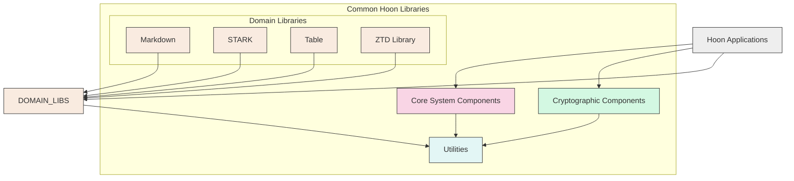
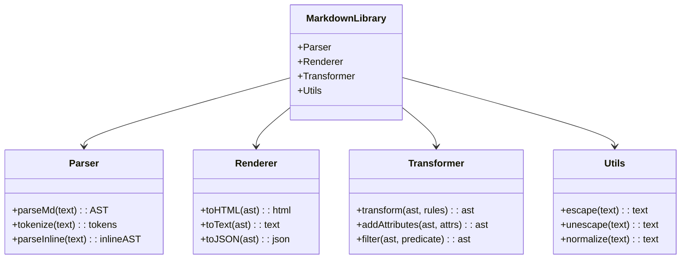
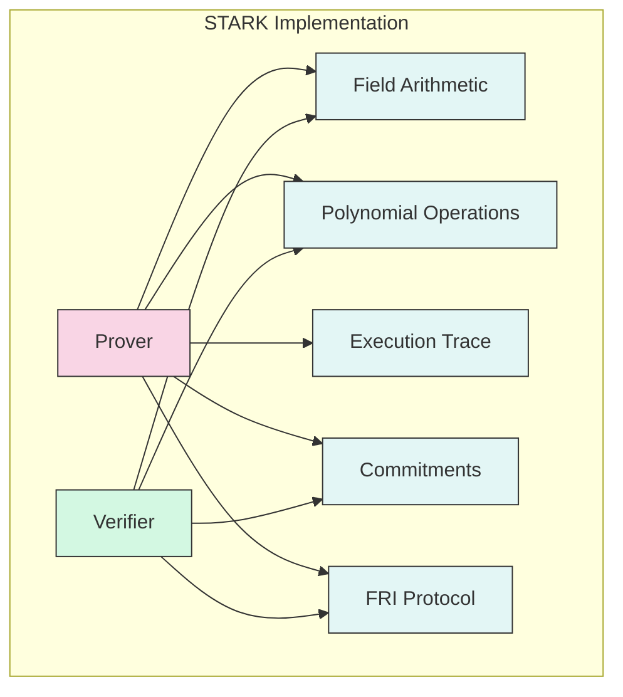
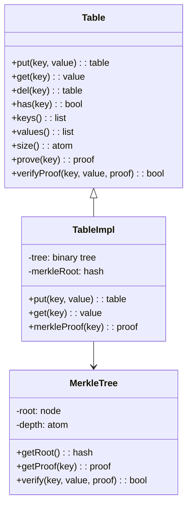
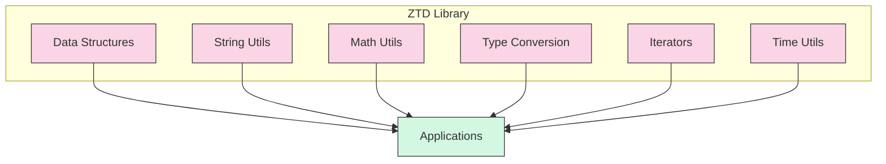
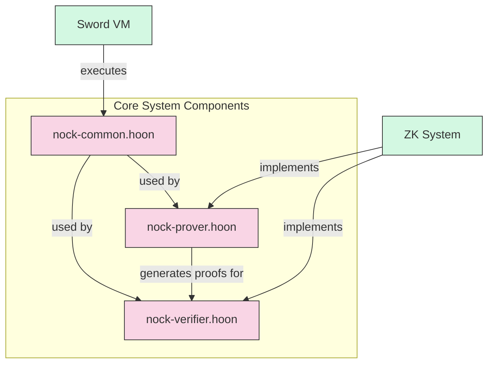
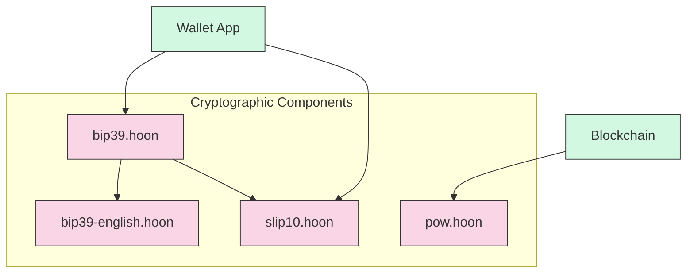
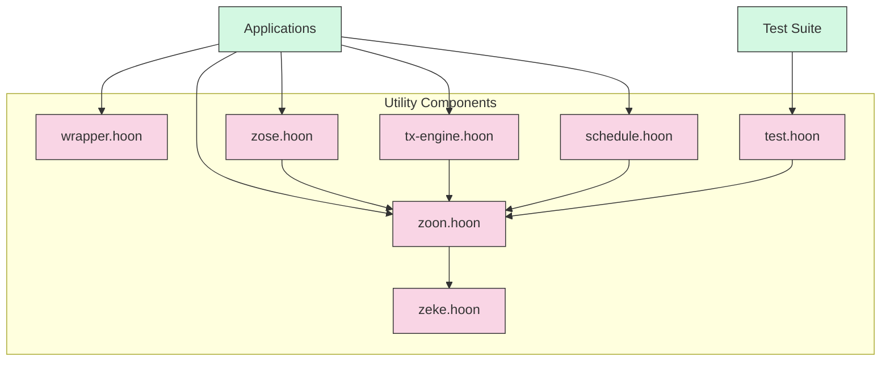
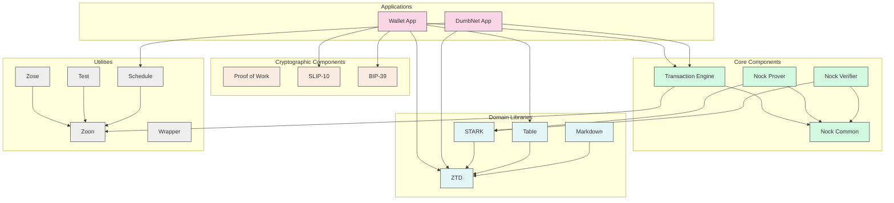

# Common Hoon Libraries

## Overview

This document describes the [common Hoon libraries and utilities](../../hoon/common/) in the [Nockchain](../../) project. These libraries provide essential functionality used across the Nockchain platform and applications.

## Libraries

### Markdown

Located in [`hoon/common/markdown/`](../../hoon/common/markdown/).

A library for Markdown processing that provides:
- Parsing of Markdown syntax
- Conversion to HTML and other formats
- Document structure manipulation
- Text formatting utilities

### STARK

Located in [`hoon/common/stark/`](../../hoon/common/stark/).

Implementation of STARK (Scalable Transparent ARguments of Knowledge) for zero-knowledge proofs:
- Proof generation algorithms
- Verification procedures
- Field arithmetic operations
- Polynomial commitment schemes

### Table

Located in [`hoon/common/table/`](../../hoon/common/table/).

Table data structure implementation with prover and verifier components:
- Efficient key-value storage
- Range-query operations
- Merkle tree integration
- Proof generation for table operations

### ZTD

Located in [`hoon/common/ztd/`](../../hoon/common/ztd/).

Standard library extensions and utilities (Zero-knowledge Toolkit and Dependencies):
- Common data structures
- String manipulation functions
- Mathematical utilities
- Type conversion helpers

## Core System Components

- [`nock-common.hoon`](../../hoon/common/nock-common.hoon): Common Nock functions for VM interaction
  - Core Nock interpreter functions
  - Memory management helpers
  - Operation optimizations
  - Debugging utilities

- [`nock-prover.hoon`](../../hoon/common/nock-prover.hoon): Nock proof generation for verifiable computation
  - Execution trace generation
  - Constraint system construction
  - Proof serialization
  - Integration with STARK library

- [`nock-verifier.hoon`](../../hoon/common/nock-verifier.hoon): Nock proof verification system
  - Proof parsing and validation
  - Constraint checking
  - Verification algorithm implementation
  - Integration with consensus system

## Cryptographic Components

- [`pow.hoon`](../../hoon/common/pow.hoon): Proof-of-work implementation for blockchain consensus
  - Hash function implementation
  - Difficulty adjustment
  - Mining algorithm
  - Block validation

- [`slip10.hoon`](../../hoon/common/slip10.hoon): SLIP-10 hierarchical deterministic key derivation
  - Master key generation
  - Child key derivation
  - Path navigation
  - Key serialization

- [`bip39.hoon`](../../hoon/common/bip39.hoon): BIP-39 mnemonic code implementation
  - Entropy to mnemonic conversion
  - Mnemonic validation
  - Mnemonic to seed conversion
  - Checksum validation

- [`bip39-english.hoon`](../../hoon/common/bip39-english.hoon): English wordlist for BIP-39
  - 2048 word dictionary
  - Word lookup functions
  - Index-to-word mapping
  - Word-to-index mapping

## Other Utilities

- [`wrapper.hoon`](../../hoon/common/wrapper.hoon): Function wrappers and higher-order functions
  - Error handling wrappers
  - Function composition helpers
  - Currying and partial application
  - Tracing and debugging wrappers

- [`zeke.hoon`](../../hoon/common/zeke.hoon): Runtime utilities for efficient execution
  - Memory optimization helpers
  - Fast path operations
  - Runtime configuration
  - Performance monitoring

- [`zoon.hoon`](../../hoon/common/zoon.hoon): Comprehensive standard library extensions
  - Enhanced list operations
  - Advanced text processing
  - Extended math functions
  - Improved data structure operations

- [`zose.hoon`](../../hoon/common/zose.hoon): Zero-knowledge system environment
  - ZK runtime configuration
  - Proof system integration
  - Constraint system helpers
  - Verification utilities

- [`test.hoon`](../../hoon/common/test.hoon): Test framework and utilities
  - Unit testing framework
  - Assertion helpers
  - Test reporting
  - Mocking utilities

- [`tx-engine.hoon`](../../hoon/common/tx-engine.hoon): Transaction processing engine
  - Transaction validation
  - State transition logic
  - Fee calculation
  - Transaction batching

- [`schedule.hoon`](../../hoon/common/schedule.hoon): Job scheduling and event handling
  - Time-based scheduling
  - Event queue management
  - Recurring job handling
  - Priority queue implementation

## Library Dependencies

