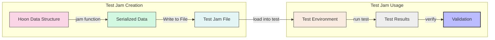
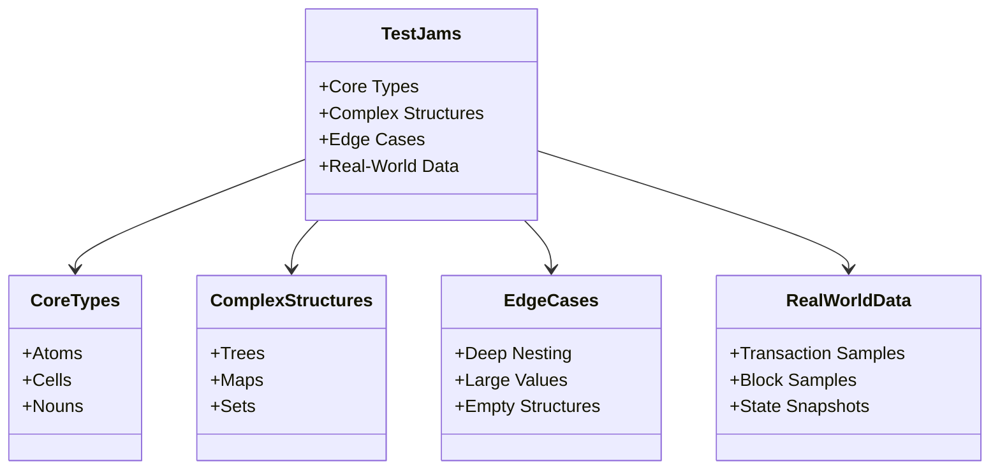
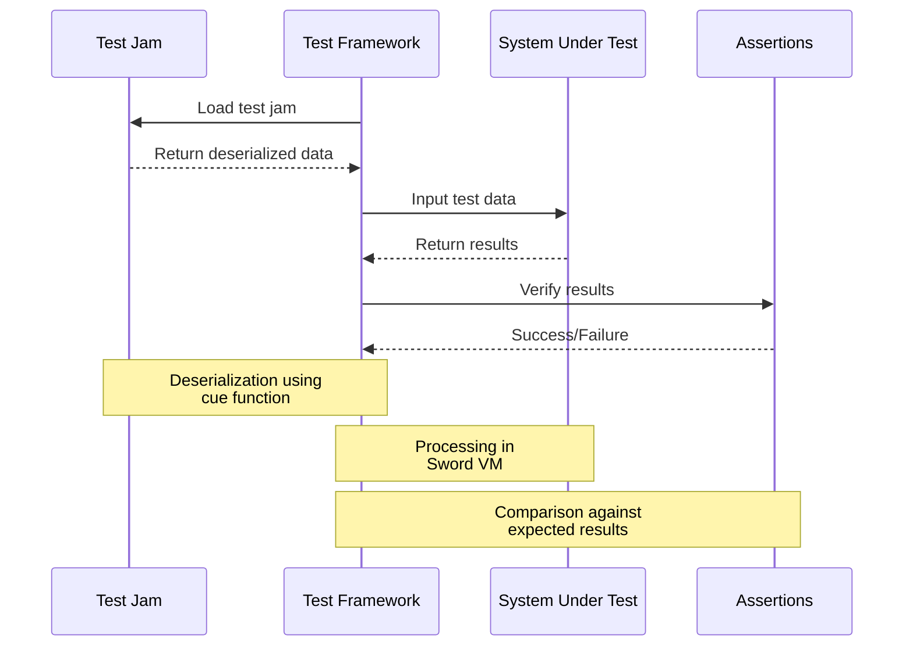
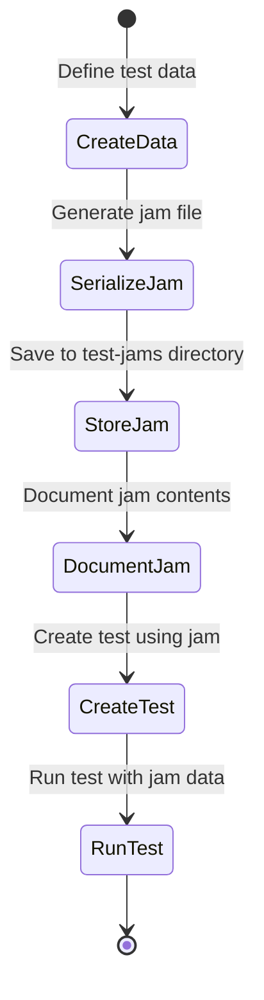

# Test Jams

## Overview

This document describes the [test jam files](../../hoon/test-jams/) in the [Nockchain](../../) project. Test jams are serialized Hoon data structures used for testing various components of the Nockchain system.



## Purpose

Test jams serve several important purposes in the Nockchain development process:

1. **Regression Testing**: Ensuring that changes to the codebase don't break existing functionality
2. **Reproducible Test Cases**: Providing consistent inputs for testing across different environments
3. **Performance Benchmarking**: Measuring the performance of components with standardized inputs
4. **Cross-Implementation Verification**: Verifying that different implementations produce the same results
5. **Deterministic Testing**: Guaranteeing that tests run with exactly the same data every time

## Structure and Content Types

The test-jams directory contains serialized Hoon data structures that can be loaded by test frameworks. These jams include:

### Core Types
- **Atoms**: Basic numerical values in various bases
- **Cells**: Pairs of values forming the basic composite structure
- **Nouns**: Fundamental recursive data structures (atoms or cells)

### Complex Structures
- **Trees**: Hierarchical data structures for testing tree operations
- **Maps**: Key-value collections for testing lookup and insertion
- **Sets**: Collections of unique values for testing set operations

### Edge Cases
- **Deep Nesting**: Deeply nested structures to test recursion limits
- **Large Values**: Extremely large atoms to test big integer handling
- **Empty Structures**: Empty or minimal structures to test edge conditions

### Real-World Data
- **Transaction Samples**: Example blockchain transactions
- **Block Samples**: Sample blockchain blocks
- **State Snapshots**: Snapshots of application state



## Usage

Test jams are used in various testing scenarios:



1. **Unit Tests**: Individual function testing with predefined inputs
   - Loading specific input data for function testing
   - Verifying output matches expected results
   - Testing edge cases and error handling

2. **Integration Tests**: Testing interactions between components
   - Testing data flow between multiple components
   - Verifying end-to-end processing
   - Testing component interfaces

3. **Benchmarking**: Performance measurement with standardized data
   - Measuring processing time for standard operations
   - Comparing performance across different implementations
   - Establishing baseline performance metrics

4. **Cross-Platform Testing**: Ensuring consistency across different platforms
   - Verifying consistent behavior across environments
   - Testing compatibility with different runtimes
   - Validating serialization/deserialization

## Implementation Details

### Jam Format

The jam format is a binary serialization of Hoon nouns, with efficient encoding for:
- Atoms (integers): Variable-length encoding optimized for common cases
- Cells (pairs): Recursive encoding of both elements
- References: Backreferences for shared substructures

### Tools and Functions

Key operations for working with test jams:

1. **jam**: Convert a noun to a jam (serialization)
   ```hoon
   (jam noun) -> jam
   ```

2. **cue**: Convert a jam to a noun (deserialization)
   ```hoon
   (cue jam) -> noun
   ```

## Development

When creating new test jams:

1. Generate the jam file using the Hoon `jam` function:
   ```hoon
   =test-data [%example-data value1 value2 ~]
   =test-jam (jam test-data)
   (spit %/path/to/test-jam/file.jam test-jam)
   ```

2. Place the jam file in the appropriate directory with a descriptive name
3. Document the contents and purpose of the jam in a comment or separate documentation
4. Include the jam in relevant test suites:
   ```hoon
   =test-data (cue (slap %/path/to/test-jam/file.jam))
   (test-function test-data)
   ```

## Testing Workflow



## Relationship with Sword

The Sword crate includes functionality for loading and processing jam files, enabling seamless integration with the test suite. The process works as follows:

1. Jam files are loaded by the Sword runtime
2. The binary data is deserialized into Nock data structures
3. These structures are used as inputs to the test functions
4. Results are compared against expected outputs
5. Test results are reported back to the test framework 