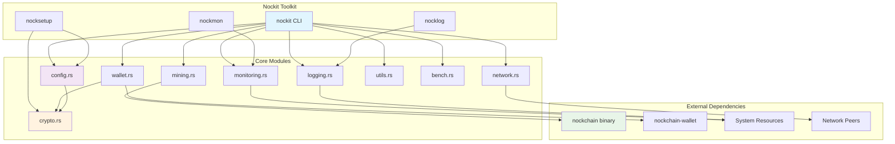

# Nockit - Nockchain Development Toolkit

[](https://www.rust-lang.org)
[](LICENSE)
[](Cargo.toml)

A comprehensive toolkit for nockchain development, monitoring, and operations. Nockit provides a unified interface for managing nockchain nodes, mining operations, wallet functionality, network monitoring, and development workflows.

## 🏗️ Architecture Overview



## 🚀 Features

### Core Functionality
- **Configuration Management**: Centralized TOML-based configuration with environment variable integration
- **Wallet Operations**: Key generation, backup, restore, and status checking
- **Mining Management**: Process control, statistics tracking, and performance analysis
- **Network Monitoring**: Connectivity diagnostics, peer management, and traffic analysis
- **System Health**: Real-time monitoring with multiple output formats
- **Development Tools**: Project scaffolding, testing, and build automation
- **Benchmarking**: Performance testing and optimization tools

### Standalone Tools
- **`nockit`**: Main CLI with comprehensive subcommands
- **`nocklog`**: Focused log management and analysis
- **`nockmon`**: Real-time system monitoring
- **`nocksetup`**: Environment initialization and setup

## 🔄 Data Flow Architecture


## 📦 Installation

### Prerequisites
- Internet connection for downloading dependencies
- Administrative privileges for system package installation
- Minimum 2GB free disk space

### Installation Flow


### Automated Setup (Recommended)

The easiest way to get started is with the automated setup tool:

```bash
# Download and run the setup script (if available)
curl -sSf https://setup.nockchain.com | sh

# Or clone the repository and run setup
git clone https://github.com/nockchain/nockchain.git
cd nockchain/nockit
./setup.sh
```

### Manual Installation

#### Step 1: Install System Dependencies

**Ubuntu/Debian:**
```bash
sudo apt update
sudo apt install -y build-essential pkg-config libssl-dev libclang-dev cmake curl wget git
```

**Fedora/RHEL/CentOS:**
```bash
sudo dnf install -y gcc gcc-c++ make cmake pkg-config openssl-devel clang-devel curl wget git
```

**Arch Linux:**
```bash
sudo pacman -Sy base-devel pkg-config openssl clang cmake curl wget git
```

**macOS:**
```bash
# Install Homebrew if not already installed
/bin/bash -c "$(curl -fsSL https://raw.githubusercontent.com/Homebrew/install/HEAD/install.sh)"

# Install dependencies
brew install pkg-config openssl cmake git
xcode-select --install
```

#### Step 2: Install Rust

```bash
# Install Rust using rustup
curl --proto '=https' --tlsv1.2 -sSf https://sh.rustup.rs | sh
source ~/.cargo/env

# Install additional components
rustup component add clippy rustfmt rust-src rust-analyzer
```

#### Step 3: Install Development Tools

```bash
# Install useful cargo tools
cargo install cargo-audit cargo-outdated cargo-tree cargo-watch
cargo install cargo-edit cargo-expand cargo-udeps cargo-deny
```

#### Step 4: Build and Install Nockit

```bash
# Clone the repository
git clone https://github.com/nockchain/nockchain.git
cd nockchain/nockit

# Build the toolkit
cargo build --release

# Install binaries
cargo install --path .
```

### Using Nocksetup Tool

The `nocksetup` tool provides comprehensive installation management:


#### Complete Setup
```bash
# Run complete automated setup
nocksetup

# Or with specific options
nocksetup install --generate-keys --non-interactive
```

#### Selective Installation
```bash
# Install only Rust and development tools
nocksetup rust --with-components --with-dev-tools

# Install only system dependencies
nocksetup deps

# Install only nockchain binaries
nocksetup nockchain --from-source

# Configure environment
nocksetup config --mining-pubkey <PUBKEY> --network testnet --log-level debug
```

#### System Checks
```bash
# Check system requirements and current status
nocksetup check

# Verify complete installation
nocksetup verify
```

#### Maintenance
```bash
# Update Rust toolchain
nocksetup update --rust

# Update nockchain binaries
nocksetup update --nockchain

# Update nockit tools
nocksetup update --nockit

# Clean temporary files
nocksetup clean --temp-only

# Remove all configuration (careful!)
nocksetup clean --all
```

### Docker Installation (Alternative)

For containerized environments:

```bash
# Build Docker image
docker build -t nockit .

# Run setup in container
docker run -it --rm -v $(pwd):/workspace nockit nocksetup
```

### Verification

After installation, verify everything is working:

```bash
# Check installed tools
rustc --version
cargo --version
git --version
nockit --version

# Run system check
nocksetup check

# Test functionality
nockit --help
nocklog --help
nockmon --help
```

## 🛠️ Usage

### Command Structure


### Configuration Management

```bash
# Initialize configuration
nockit setup

# View current configuration
cat .nockit/config.toml

# Set mining public key
nockit wallet keygen
```

### Wallet Operations


```bash
# Generate new wallet keys
nockit wallet keygen --output my_keys.json

# Check wallet status
nockit wallet status

# Backup wallet keys
nockit wallet backup --output ./backups/

# Restore from backup
nockit wallet restore --input ./backups/wallet_backup_20240101_120000.export
```

### Mining Management


```bash
# Start mining
nockit mining start --pubkey <YOUR_PUBKEY>

# Check mining status
nockit mining status

# Analyze mining performance
nockit mining stats --period 1d

# Stop mining
nockit mining stop
```

### Network Monitoring


```bash
# Check network status
nockit network status

# List connected peers
nockit network peers

# Test connectivity
nockit network ping

# Monitor traffic
nockit network traffic --duration 300
```

### Log Management

```bash
# Tail live logs
nockit logs tail --follow

# Search logs
nockit logs search "error|warning" --file nockchain.log

# Analyze log patterns
nockit logs analyze --period 6h

# Export logs
nockit logs export --format json --output logs_export.json

# Clean old logs (standalone tool)
nocklog clean --days 7
```

### System Monitoring

```mermaid
graph TD
    subgraph "System Monitoring Dashboard"
        CPU[CPU Usage]
        MEMORY[Memory Usage]
        DISK[Disk Usage]
        NETWORK_IO[Network I/O]
        PROCESSES[Process Count]
        NOCKCHAIN_HEALTH[Nockchain Health]
    end
    
    subgraph "Data Collection"
        SYSINFO[System Info API]
        PROC_FS[/proc filesystem]
        NOCKCHAIN_API[Nockchain API]
        LOG_ANALYSIS[Log Analysis]
    end
    
    subgraph "Output Formats"
        TABLE[Table Format]
        JSON[JSON Format]
        COMPACT[Compact Format]
        TUI[Terminal UI]
    end
    
    subgraph "Alerting"
        THRESHOLDS[Threshold Monitoring]
        NOTIFICATIONS[Notifications]
        HEALTH_STATUS[Health Status]
    end
    
    CPU --> SYSINFO
    MEMORY --> SYSINFO
    DISK --> SYSINFO
    NETWORK_IO --> PROC_FS
    PROCESSES --> SYSINFO
    NOCKCHAIN_HEALTH --> NOCKCHAIN_API
    NOCKCHAIN_HEALTH --> LOG_ANALYSIS
    
    SYSINFO --> TABLE
    SYSINFO --> JSON
    SYSINFO --> COMPACT
    SYSINFO --> TUI
    
    CPU --> THRESHOLDS
    MEMORY --> THRESHOLDS
    DISK --> THRESHOLDS
    NOCKCHAIN_HEALTH --> THRESHOLDS
    
    THRESHOLDS --> NOTIFICATIONS
    THRESHOLDS --> HEALTH_STATUS
    
    style CPU fill:#ffcdd2
    style MEMORY fill:#c8e6c9
    style DISK fill:#bbdefb
    style NOCKCHAIN_HEALTH fill:#fff9c4
```

```bash
# Real-time monitoring
nockit monitor --interval 5 --format table

# Single health check
nockmon --once --format json

# Compact monitoring
nockmon --format compact --interval 2
```

### Development Utilities

```bash
# Initialize new project
nockit dev init my_nockchain_project

# Run tests
nockit dev test

# Build project
nockit dev build --target release

# Clean artifacts
nockit dev clean
```

### Benchmarking


```bash
# Run comprehensive benchmarks
nockit bench --all

# Run specific benchmark category
nockit bench crypto --iterations 1000

# Compare with baseline
nockit bench --compare baseline.json

# Export benchmark results
nockit bench --output benchmark_results.json
```

## 📚 API Documentation

### Module Relationships


### Configuration Module (`config.rs`)

The configuration module provides centralized management of nockit settings:

```rust
use nockit::config::NockitConfig;

// Load or create default configuration
let config = NockitConfig::load_or_create(".nockit")?;

// Set mining public key
config.set_mining_pubkey("your_pubkey_here".to_string());

// Save configuration
config.save(".nockit/config.toml")?;
```

#### Configuration Structure
```toml
[nockchain]
binary_path = "nockchain"
data_dir = ".data.nockchain"
bind_address = "/ip4/0.0.0.0/udp/0/quic-v1"
peer_port = 0

[wallet]
binary_path = "nockchain-wallet"
wallet_dir = ".nockchain-wallet"
backup_dir = "wallet-backups"

[mining]
default_pubkey = "your_pubkey_here"
difficulty_target = 12345
stats_retention_days = 30

[network]
bootstrap_peers = []
connection_timeout = 30
max_peers = 50

[logging]
level = "info"
format = "pretty"
rotation_size_mb = 100
retention_days = 7

[benchmarking]
iterations = 1000
warmup_iterations = 100
output_format = "table"
save_results = true
```

### Cryptographic Module (`crypto.rs`)

Provides cryptographic utilities for key management and security:

```rust
use nockit::crypto::{KeyPair, hash_data, PublicKey};

// Generate new key pair
let keypair = KeyPair::generate()?;

// Sign message
let message = b"Hello, Nockchain!";
let signature = keypair.private_key.sign(message)?;

// Verify signature
let is_valid = keypair.public_key.verify(message, &signature)?;

// Hash data
let data = b"data to hash";
let hash = hash_data(data);
```

### Wallet Module (`wallet.rs`)

Manages wallet operations and key management:

```rust
use nockit::wallet::{generate_keys, check_status};

// Generate new wallet keys
generate_keys(Some(&output_path), &config_dir).await?;

// Check wallet status
check_status(Some("pubkey"), &config_dir).await?;
```

### Mining Module (`mining.rs`)

Controls mining operations and statistics:

```rust
use nockit::mining::{start_mining, MiningStats};

// Start mining process
start_mining("pubkey", Some(12345), &config_dir).await?;

// Create mining statistics
let stats = MiningStats {
    start_time: chrono::Utc::now(),
    blocks_mined: 10,
    hash_rate: 1000.0,
    // ... other fields
};
```

### Network Module (`network.rs`)

Provides network monitoring and diagnostics:

```rust
use nockit::network::{check_status, NetworkStatus};

// Check network connectivity
check_status(&config_dir).await?;

// Create network status
let status = NetworkStatus {
    connected_peers: 5,
    connectivity: ConnectivityStatus::Connected,
    // ... other fields
};
```

### Monitoring Module (`monitoring.rs`)

Real-time system health monitoring:

```rust
use nockit::monitoring::{run_monitor, SystemHealth};

// Run continuous monitoring
run_monitor(5, "table", &config_dir).await?;

// Collect system health
let health = collect_system_health(&config_dir).await?;
```

### Logging Module (`logging.rs`)

Advanced log management and analysis:

```rust
use nockit::logging::{init_logging, tail_logs};

// Initialize logging system
init_logging("info", &log_dir)?;

// Tail logs with following
tail_logs(100, true, &config_dir).await?;
```

### Benchmarking Module (`bench.rs`)

Performance testing and optimization:

```rust
use nockit::bench::{run_benchmarks, BenchmarkConfig};

// Run comprehensive benchmarks
let config = BenchmarkConfig::default();
let results = run_benchmarks(&config).await?;

// Run specific benchmark
let crypto_results = run_crypto_benchmarks(1000).await?;
```

## 🔧 Configuration

### Environment Variables

Nockit supports configuration through environment variables:

```bash
# Logging configuration
export RUST_LOG=info,nockchain=debug
export MINIMAL_LOG_FORMAT=true

# Mining configuration
export MINING_PUBKEY=your_public_key_here

# Network configuration
export PEER_PORT=8080
export BIND_ADDRESS=/ip4/0.0.0.0/udp/8080/quic-v1

# Benchmarking configuration
export BENCH_ITERATIONS=1000
export BENCH_OUTPUT_FORMAT=json
```

### Configuration Files


#### Main Configuration (`.nockit/config.toml`)
Primary configuration file with all nockit settings.

#### Environment File (`.nockit/.env`)
Environment variables for nockchain operations.

#### Helper Scripts (`.nockit/scripts/`)
- `start_mining.sh`: Start mining operations
- `stop_mining.sh`: Stop mining operations  
- `check_status.sh`: Check system status

## 🧪 Testing

### Test Architecture


### Running Tests

```bash
# Run all tests
cargo test

# Run integration tests
cargo test --test integration_tests

# Run with output
cargo test -- --nocapture

# Run specific test
cargo test test_config_management

# Run performance tests
cargo test --release test_performance_benchmarks
```

### Test Coverage

The test suite covers:
- Configuration management and serialization
- Cryptographic operations and key management
- Wallet operations and backup/restore
- Mining statistics and process management
- Network monitoring and connectivity
- System health monitoring
- Error handling and edge cases
- Concurrent operations
- Performance benchmarks
- Security vulnerabilities

### Benchmarking

```bash
# Run performance benchmarks
cargo test test_performance_benchmarks -- --nocapture

# Run specific benchmark suite
nockit bench crypto --iterations 10000

# Compare performance over time
nockit bench --compare previous_results.json
```

## 📊 Monitoring and Metrics

### Health Status Levels


- **Healthy**: All systems operational
- **Warning**: Minor issues or missing configuration
- **Critical**: Major failures requiring attention
- **Unknown**: Unable to determine status

### System Metrics
- CPU usage percentage
- Memory usage percentage
- Disk usage percentage
- Network traffic (RX/TX bytes)
- Process count

### Mining Statistics
- Blocks mined
- Hash rate (H/s)
- Difficulty target
- Rewards earned
- Uptime tracking
- Error logging

### Network Metrics
- Connected peer count
- Connection status
- Traffic statistics
- Latency measurements

### Performance Metrics
- Operation throughput
- Response latency
- Resource utilization
- Error rates

## 🔒 Security

### Security Architecture


### Key Management
- Private keys are handled securely with redacted debug output
- Backup encryption support
- Secure key derivation from passwords
- Base58 encoding for public keys and signatures

### Best Practices
- Regular key backups
- Secure storage of private keys
- Environment variable protection
- Log sanitization
- Input validation
- Secure defaults

## 🚀 Development

### Project Structure
```
nockit/
├── src/
│   ├── bin/           # Standalone binaries
│   │   ├── nocklog.rs    # Log management tool
│   │   ├── nockmon.rs    # System monitoring tool
│   │   └── nocksetup.rs  # Setup and installation tool
│   ├── config.rs      # Configuration management
│   ├── crypto.rs      # Cryptographic utilities
│   ├── logging.rs     # Log management
│   ├── mining.rs      # Mining operations
│   ├── monitoring.rs  # System monitoring
│   ├── network.rs     # Network diagnostics
│   ├── setup.rs       # Environment setup
│   ├── utils.rs       # Development utilities
│   ├── wallet.rs      # Wallet operations
│   ├── bench.rs       # Benchmarking tools
│   ├── lib.rs         # Library exports
│   └── main.rs        # Main CLI
├── tests/
│   ├── integration_tests.rs
│   ├── performance_tests.rs
│   └── security_tests.rs
├── examples/
│   ├── basic_usage.rs
│   ├── advanced_config.rs
│   └── custom_benchmarks.rs
├── Cargo.toml
├── setup.sh
└── README.md
```

### Development Workflow


### Contributing

1. Fork the repository
2. Create a feature branch
3. Add tests for new functionality
4. Ensure all tests pass
5. Submit a pull request

### Code Style
- Follow Rust standard formatting (`cargo fmt`)
- Use Clippy for linting (`cargo clippy`)
- Add comprehensive documentation
- Include unit and integration tests
- Follow security best practices

## 📋 Troubleshooting

### Diagnostic Flow


### Common Issues

#### "nockchain binary not found"
```bash
# Install nockchain
make install-nockchain

# Or specify path in config
nockit setup --force
```

#### "Mining process not starting"
```bash
# Check configuration
nockit wallet status

# Generate keys if needed
nockit wallet keygen

# Check logs
nocklog tail --follow
```

#### "Network connectivity issues"
```bash
# Test basic connectivity
nockit network status

# Check firewall settings
# Ensure ports are open for P2P communication
```

#### "Performance issues"
```bash
# Run performance benchmarks
nockit bench --all

# Check system resources
nockmon --once

# Analyze logs for bottlenecks
nocklog analyze --period 1h
```

### Debug Mode
```bash
# Enable verbose logging
nockit --verbose <command>

# Or set environment variable
export RUST_LOG=debug
nockit <command>
```

### Log Analysis
```bash
# Search for errors
nocklog search "error|failed|panic"

# Analyze recent activity
nocklog analyze --period 1h

# Export logs for analysis
nocklog export --format json --output debug_logs.json
```

## 📄 License

This project is licensed under the MIT License - see the [LICENSE](LICENSE) file for details.

## 🤝 Support

- **Documentation**: This README and inline code documentation
- **Issues**: GitHub Issues for bug reports and feature requests
- **Community**: Join the nockchain community discussions

## 🗺️ Roadmap

### Development Timeline


### Version 0.6.0
- [ ] Enhanced mining pool support
- [ ] Advanced network topology visualization
- [ ] Automated backup scheduling
- [ ] Performance optimization

### Version 0.7.0
- [ ] Web-based monitoring dashboard
- [ ] Plugin system for extensions
- [ ] Advanced analytics and reporting
- [ ] Multi-node cluster management

### Version 1.0.0
- [ ] Production-ready stability
- [ ] Comprehensive documentation
- [ ] Enterprise features
- [ ] Long-term support

---

## 🧠 Intelligent Design Rationale

The nockit toolkit represents a comprehensive approach to nockchain development and operations, designed with the following principles:

### Modular Architecture
The toolkit employs a modular design where each component serves a specific purpose while maintaining clear interfaces for interaction. This approach ensures maintainability, testability, and extensibility.

### Security-First Design
Security considerations are embedded throughout the architecture, from cryptographic key management to secure logging practices. The toolkit implements defense-in-depth strategies to protect sensitive operations.

### Performance Optimization
The inclusion of comprehensive benchmarking tools and performance monitoring ensures that the toolkit not only provides functionality but also maintains optimal performance characteristics under various operational conditions.

### Developer Experience
The toolkit prioritizes developer experience through intuitive CLI interfaces, comprehensive documentation, and clear error messages. The inclusion of development utilities and scaffolding tools accelerates the development workflow.

### Operational Excellence
Real-time monitoring, logging, and diagnostic capabilities ensure that operators have the visibility and tools necessary to maintain healthy nockchain deployments in production environments.

This comprehensive design ensures that nockit serves as both a development toolkit and an operational platform, supporting the full lifecycle of nockchain applications from development through production deployment and maintenance. 